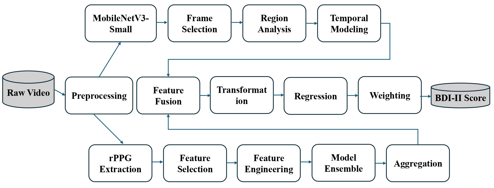
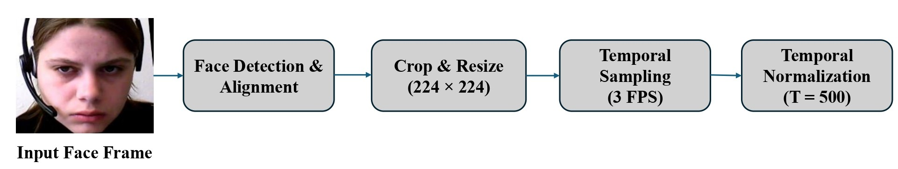
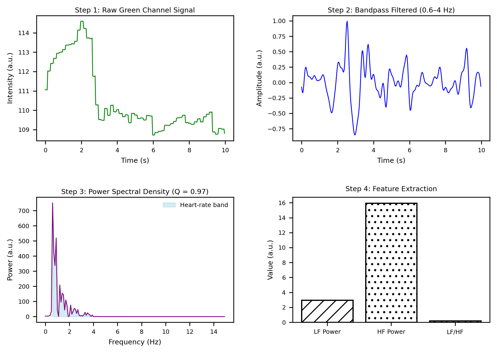
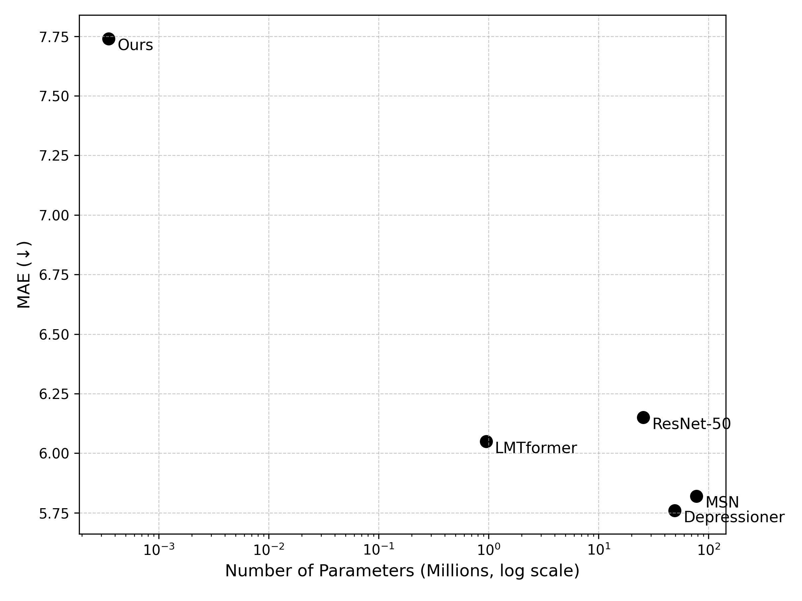

# LightFusionNet: A Lightweight Multimodal Fusion Framework for Depression Severity Detection

[](#)
[](#)

Official repository for the paper: **"LightFusionNet: A Lightweight Multimodal Fusion Framework Combining Facial Dynamics and rPPG Signals for Depression Severity Detection"**.

---

## Authors
**Muhammad Bilal¹***, Muhammad Turyalai Khan², and Faisal Shafait³
¹ *GIK Institute of Engineering Sciences and Technology, Pakistan*
² *Guangdong Provincial People's Hospital, China*
³ *National University of Sciences and Technology (NUST), Pakistan*
`* Corresponding Author: u2023392@giki.edu.pk`

---

## Abstract
Depression detection often relies on high-complexity deep learning models that are difficult to deploy on edge devices. **LightFusionNet** addresses this by introducing a "Green AI" multimodal framework. We combine facial dynamics (using a truncated MobileNetV3-Small) and physiological signals (rPPG) through an ultra-lightweight SVR-based fusion head. 

Our framework achieves a **Mean Absolute Error (MAE) of 7.59** on the AVEC 2014 dataset with only **0.46M parameters**, making it significantly more efficient than state-of-the-art transformers and heavy CNNs.

---

## Key Features
- **Green AI Philosophy:** Optimized for high performance with minimal carbon footprint and computational cost.
- **Ultra-Lightweight Fusion:** The fusion mechanism adds only **350 parameters** and **350 FLOPs**.
- **Multimodal Synergy:** Integrates visual cues (facial expressions) with physiological biomarkers (heart rate variability from rPPG).
- **Region-Specific Analysis:** Analyzes periocular (eyes) and perioral (mouth) regions with specialized weighting for depression markers.

---

## Methodology

### 1. System Architecture
<!--  -->

*Figure 1: Schematic of the LightFusionNet architecture showing the parallel visual and physiological streams.*

### 2. Visual Modality (Facial Dynamics)

*Figure 2: Preprocessing pipeline including face mesh alignment and regional cropping.*
- **Backbone:** Truncated **MobileNetV3-Small** (Pre-trained on ImageNet).
- **Feature Extraction:** 576-D deep feature vectors representing facial dynamics across 500-frame segments.

### 3. Physiological Modality (rPPG)

*Figure 3: rPPG signal extraction and Heart Rate Variability (HRV) feature engineering.*
- **Extraction:** CPU-efficient **Green Channel** method.
- **Quality Control:** Signal-to-Noise Ratio (SNR) filtering to ensure only high-fidelity signals are fused.

### 4. SVR-Power Fusion
The fusion layer utilizes a **Yeo-Johnson Power Transformation** to normalize multimodal features, followed by a Support Vector Regressor (SVR) that captures the non-linear relationship between facial affect and physiological response.

---

## Experimental Results

### Performance on AVEC 2014 Dataset
| Modality | Model | MAE ↓ | RMSE ↓ | PCC ↑ |
| :--- | :--- | :---: | :---: | :---: |
| Visual | Truncated MobileNetV3 | 8.42 | 10.20 | 0.47 |
| Physiological | Stacking Ensemble | 9.32 | 11.40 | -0.11 |
| **Multimodal** | **LightFusionNet (Ours)** | **7.59** | **9.79** | **0.49** |

### Efficiency vs. Accuracy Trade-off

*Figure 4: LightFusionNet (bottom left) compared to SOTA models. Note the logarithmic scale for parameters; we achieve competitive MAE with ~100x fewer parameters.*

### Comparison with State-of-the-Art
| Method | Modality | MAE | Params (M) | FLOPs (G) |
| :--- | :--- | :---: | :---: | :---: |
| MSN [15] | Visual | 5.82 | 77.7 | 164.9 |
| LMTformer [35] | Visual | 6.05 | 0.95 | 1.1 |
| **LightFusionNet** | **Visual + rPPG** | **7.59** | **0.46** | **0.125** |

---

## Tech Stack
- **Languages:** Python 3.8+
- **Frameworks:** PyTorch, Scikit-Learn
- **Libraries:** MediaPipe (Face Mesh), OpenCV, SciPy
- **Hardware:** Tested on Tesla T4 GPU & Standard Intel i7 CPU (Real-time capable)

---

## Project Status
> 🔬 **Note:** This project is currently **under review at ICPR 2024**. 
> 
> **The source code, pre-trained weights, and processed features will be released here upon formal acceptance of the paper.**

---

## Citation
If you find this work useful for your research, please cite:

```bibtex
@article{bilal2024lightfusionnet,
  title={LightFusionNet: A Lightweight Multimodal Fusion Framework Combining Facial Dynamics and rPPG Signals for Depression Severity Detection},
  author={Bilal, Muhammad and Khan, Muhammad Turyalai and Shafait, Faisal},
  journal={Under Review (ICPR)},
  year={2024}
}
